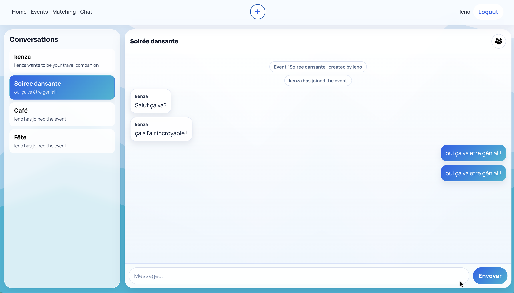
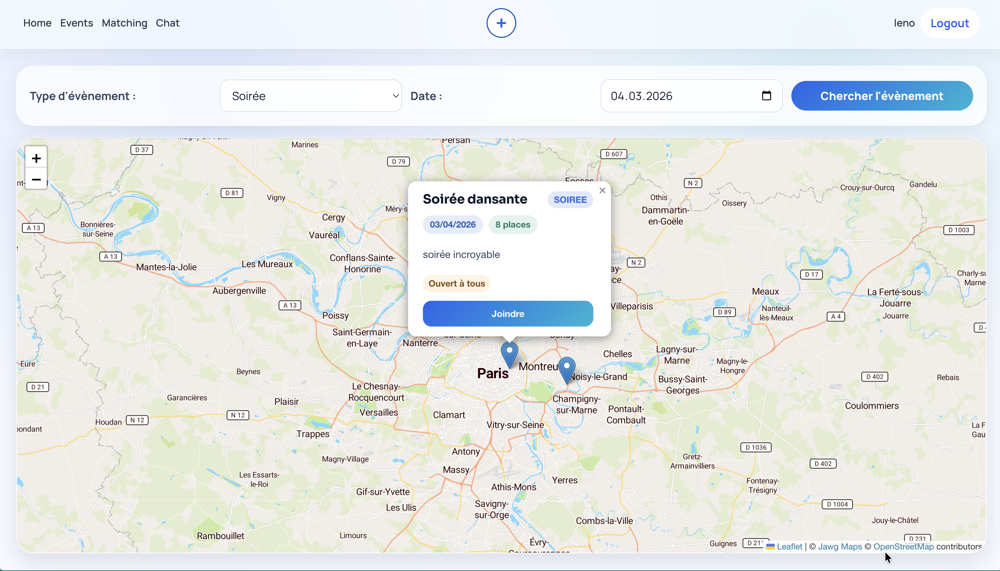
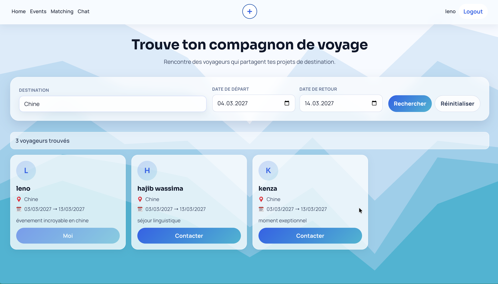
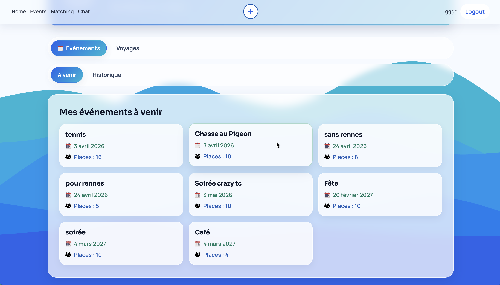

# Social Network React Fastify


A full-stack social platform for INSA students to discover events, create trips, match with travel companions, and chat in real time. The project is built with a React + Vite frontend and a Fastify + PostgreSQL backend.

## Overview

This repository implements a student-focused social network where users can:

- Register and authenticate with JWT-based sessions.
- Create and browse events with map-based discovery.
- Join events depending on audience rules (`openTo`) tied to INSA departments.
- Create and search trips, then contact compatible travelers.
- Chat inside event or companion conversations with real-time updates through Socket.IO.
- Track upcoming and past activities from their profile.

The application is split into two apps:

- `frontend`: React SPA served with Vite.
- `backend`: Fastify API with PostgreSQL integration and Socket.IO.

## Features

- Authentication and profile basics
- Event creation, discovery, and join flow
- Trip creation and trip matching
- Travel companion conversations
- Real-time messaging and conversation previews
- Upcoming and historical views for events and trips
- Interactive maps for location-based navigation

### UI previews

#### Chat and conversations

Shows the chat area with conversations and messages.



#### Event map search

Shows the event map with a displayed event card and join action.



#### Trip matching and upcoming trips

Shows the matching panel with search and upcoming trips context.



#### Upcoming events page

Shows the `Mes evenements a venir` profile section.



## Tech Stack

### Frontend

- React 19
- React Router
- Vite
- Sass (SCSS modules + global styles)
- Leaflet + React Leaflet
- MapTiler geocoding client
- Socket.IO client

### Backend

- Node.js (ES modules)
- Fastify 5
- Fastify plugins: CORS, JWT, PostgreSQL
- PostgreSQL
- Socket.IO
- bcrypt
- dotenv

## Installation

### Prerequisites

- Node.js 20+
- npm 9+
- PostgreSQL database accessible from your machine
- MapTiler API key (for geocoding in the frontend)

### 1. Clone repository

```bash
git clone <your-repo-url>
cd social-network-react-fastify
```

### 2. Install backend dependencies

```bash
cd backend
npm install
```

### 3. Configure backend environment

Create `backend/.env`:

```env
SERVER_PORT=8888
DATABASE_URL=postgres://<user>:<password>@<host>:<port>/<database>
JWT_SECRET=<your_jwt_secret>
```

### 4. Install frontend dependencies

```bash
cd ../frontend
npm install
```

### 5. Configure frontend environment

Create `frontend/.env`:

```env
VITE_BACKEND_URL=http://localhost:8888
VITE_MAPTILER_API_KEY=<your_maptiler_key>
```

## Usage

### Run backend

```bash
cd backend
npm run dev
```

### Run frontend

```bash
cd frontend
npm run dev
```

By default:

- Frontend runs on Vite default host/port (commonly `http://localhost:5173`).
- Backend runs on `SERVER_PORT` from `backend/.env`.

### Typical user flow

1. Register or log in.
2. Create an event or trip.
3. Browse events on the map and join.
4. Use matching to find travel companions.
5. Open chat to continue conversations.
6. Check profile tabs for upcoming/history sections.

## Project Structure

```text
social-network-react-fastify/
├─ backend/
│  ├─ controllers/
│  ├─ plugins/
│  ├─ routes/
│  ├─ services/
│  ├─ socket/
│  ├─ utils/
│  ├─ package.json
│  └─ server.js
├─ frontend/
│  ├─ public/
│  ├─ src/
│  │  ├─ Api/
│  │  ├─ Assets/
│  │  ├─ Components/
│  │  ├─ Context/
│  │  ├─ Data/
│  │  ├─ Pages/
│  │  ├─ realtime/
│  │  ├─ App.jsx
│  │  └─ main.jsx
│  ├─ package.json
│  └─ vite.config.js
├─ Ressources/
│  ├─ messages.png
│  ├─ search_events.png
│  ├─ upcoming_events.png
│  └─ voyage.png
└─ README.md
```

## API Surface (high level)

Main backend routes discovered in the codebase:

- Auth: `/register`, `/login`, `/me`
- Events: `/createEvent`, `/getEvents`, `/getUserEvents/:username`, `/joinEvent`
- Voyages: `/createVoyage`, `/getVoyages`, `/getUserVoyages/:username`
- Matching: `/api/matching`, `/api/matching/joinTravelCompanion`
- Messaging: `/conversations`, `/message/:eventId`, `/message`, `/conversation/:eventId/members`

## Notes

- The backend expects an existing PostgreSQL schema (tables such as `users`, `events`, `voyages`, `messages`, `event_participants`, and `travel_companions` are referenced in services).
- CORS is currently configured with `origin: *` for development convenience.

## License

No license file was detected in this repository.
If you plan to publish the project, add a `LICENSE` file (for example MIT) at the repository root.
